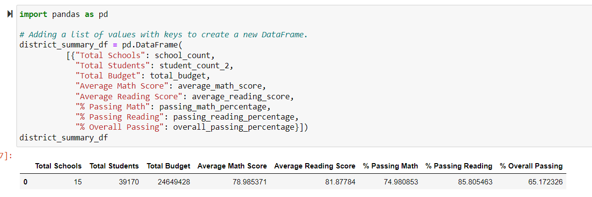
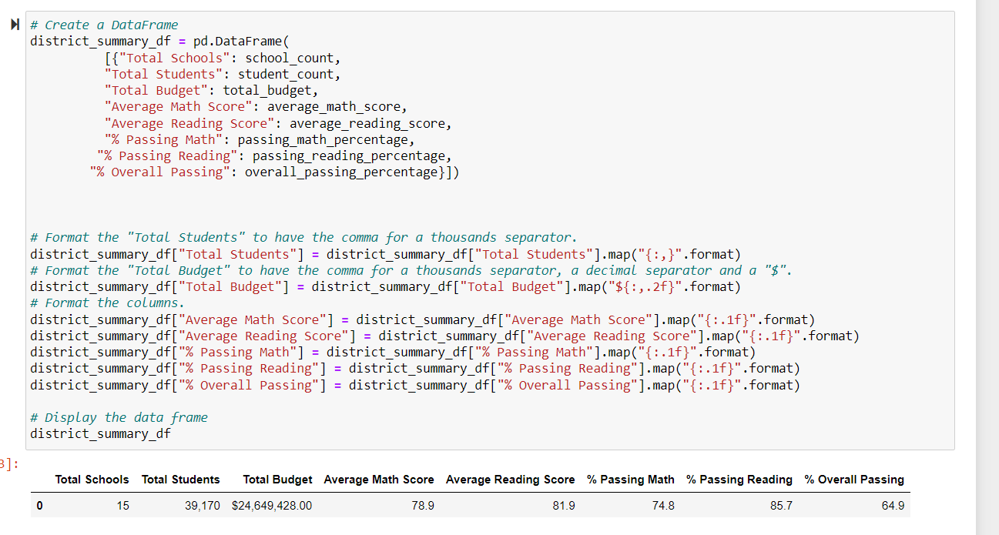

# School_District_Analysis
### Overview of the School District Analysis
The purpose of this analysis is to assess school performance based on the performance of standardized test scores in math and reading and funding. Such information will be used by members of the school board and superintendent to make informed budgetary decisions within the school and district level.
After the initial analysis, the school board suspected academic dishonesty in math and reading scores for ninth graders at Thomas High School. As such, the ninth grade test scores (math and reading) for students in Thomas High School were removed and a second analysis was performed.

#### How is the district summary affected?
**With the ninth grade scores from Thomas High School removed**, the average math score, % passing Math, % passing Reading, and % Overall Passing all decreased slightly by a few tenths of its respective value. A comparison of the two results are presented below in figure.1 (1st analysis) and figure.2 (2nd analysis).
######  **Figure. 1 (1st analysis)**

######  **Figure. 2 (2nd analysis)**

#### How is the school summary affected?

#### How does replacing the ninth-grade scores affect the following:
##### Math and reading score by grade

##### Scores by school spending

##### Scores by school size

##### Scores by school type

#### Summary
1. The average math score, % passing Math, % passing Reading, and % Overall Passing in the district summary all decreased by at least 0.1 of value.
2. Thomas High School’s average math score, average reading score, % passing math, % passing reading, and % overall passing decreased between 0.01 to 0.5 points
3. However, this did not negatively affect Thomas High School’s overall performance. While its % overall passing decreased by 0.3%, it was not substantial enough to lower their rank position compared to other schools in the district.
4. The average math and reading scores, % passing math, % passing reading, and % overall passing values were not affected based on the amount spent per student, whether the school is charter or district, and overall school size based on the student population number.  
