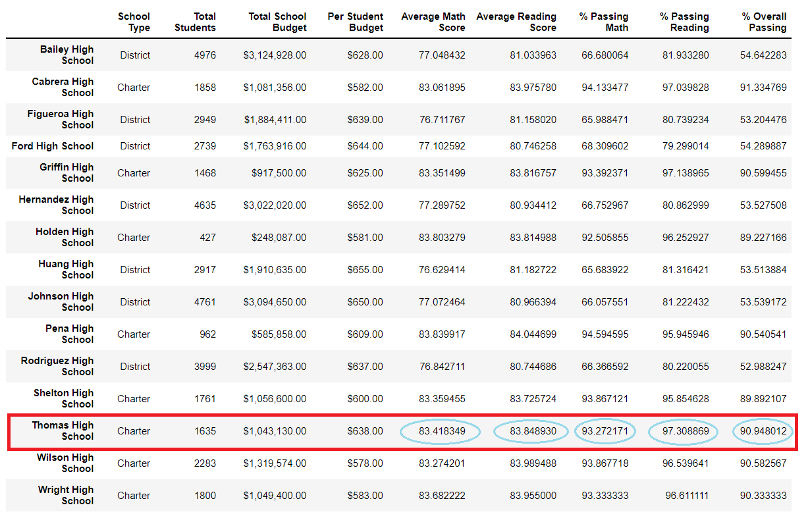
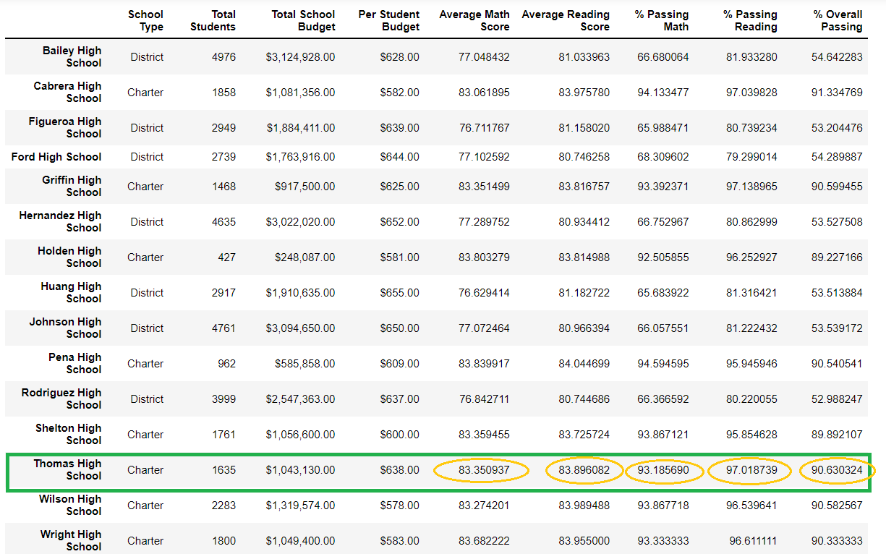
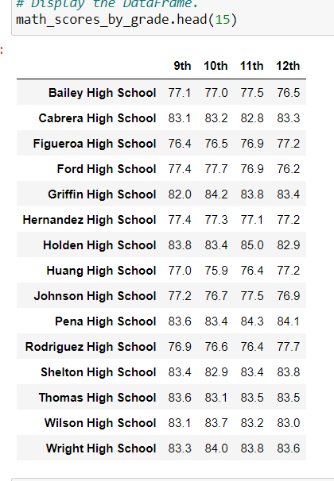
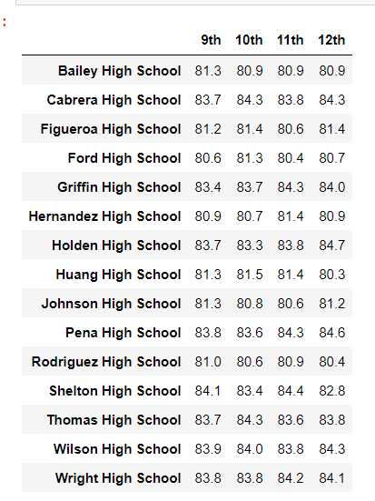
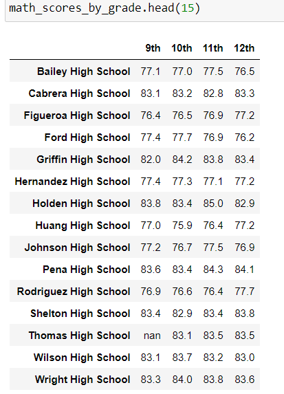
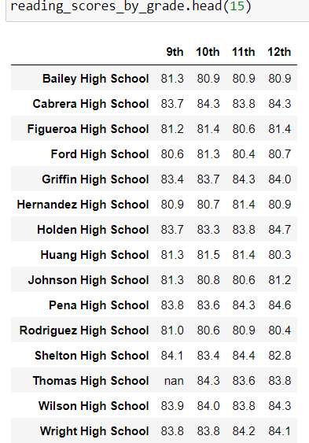

# School_District_Analysis
### Overview of the School District Analysis
The purpose of this analysis is to assess school performance based on the performance of standardized test scores in math and reading and funding. Such information will be used by members of the school board and superintendent to make informed budgetary decisions within the school and district level.
After the initial analysis, the school board suspected academic dishonesty in math and reading scores for ninth graders at Thomas High School. As such, the ninth grade test scores (math and reading) for students in Thomas High School were removed and a second analysis was performed.

#### How is the district summary affected?
With the ninth grade scores from Thomas High School removed, the average math score, % passing Math, % passing Reading, and % Overall Passing all decreased slightly by a few tenths of its respective value. A comparison of the two results are presented below in **Figure.1 (1st analysis) and Figure.2 (2nd analysis).**
##### Figure.1 (1st analysis of district summary)

##### Figure.2 (2nd analysis of district summary)

#### How is the school summary affected?
The following performance parameters for Thomas High School:  average math score, average reading score, % passing math, % passing reading, and % overall passing decreased between 0.01 to 0.5 points. The values are presented in figure. 3 (first analysis) and figure. 4 (second analysis with ninth grade scores from Thomas High School removed). All other schools’ performance parameters were not affected.
##### Figure.3 (1st analysis of school summary)

##### Figure.4 (2nd analysis of school summary)

#### How does replacing the ninth graders’ math and reading scores affect Thomas High School’s performance relative to the other schools?
The replacement of ninth graders’ math and reading scores did not result in a substantial change in Thomas School’s performance relative to other schools. Their % overall passing decreased by 0.3%, not significant enough to move them down the list of school performance based on this parameter as presented in Figure.6 (2nd analysis) compared to Figure.5 (1st analysis).

##### Figure.5 (1st analysis of school summary- refer to column % overall Passing under row of Thomas High School)

##### Figure.6 (2st analysis of school summary- refer to column % overall Passing under row of Thomas High School)

#### How does replacing the ninth-grade scores affect the following:
##### Math and reading score by grade
Math and reading scores for ninth grade under Thomas High School were removed and replaced with ‘NaN’ as presented in figure.8 (2nd analysis - math scores) & figure. 9(2nd analysis - reading scores). All other scores for the remaining grades within the school were not affected. Scores for other schools were not affected either if comparing the data from the first analysis in figures.8 & 9 to figures.10 & 11 (2nd analysis).

##### Figure.7 (1st analysis of math scores for all schools)

##### Figure.8 (1st analysis of reading scores for all schools)

##### Figure.9 (2nd analysis of math scores for all schools)

##### Figure.10 (2nd analysis of reading scores for all schools)

##### Scores by school spending
No changes were found in the scores by school spending, as supported by results from the first analysis (figure.11) compared to results from the second analysis (figure.12)

##### Figure.11 (1st analysis of math scores for all schools)

##### Figure.12 (2nd analysis of math scores for all schools)

##### Scores by school size

##### Scores by school type

#### Summary
1. The average math score, % passing Math, % passing Reading, and % Overall Passing in the district summary all decreased by at least 0.1 of value.
2. Thomas High School’s average math score, average reading score, % passing math, % passing reading, and % overall passing decreased between 0.01 to 0.5 points
3. However, this did not negatively affect Thomas High School’s overall performance. While its % overall passing decreased by 0.3%, it was not substantial enough to lower their rank position compared to other schools in the district.
4. The average math and reading scores, % passing math, % passing reading, and % overall passing values were not affected based on the amount spent per student, whether the school is charter or district, and overall school size based on the student population number.  
